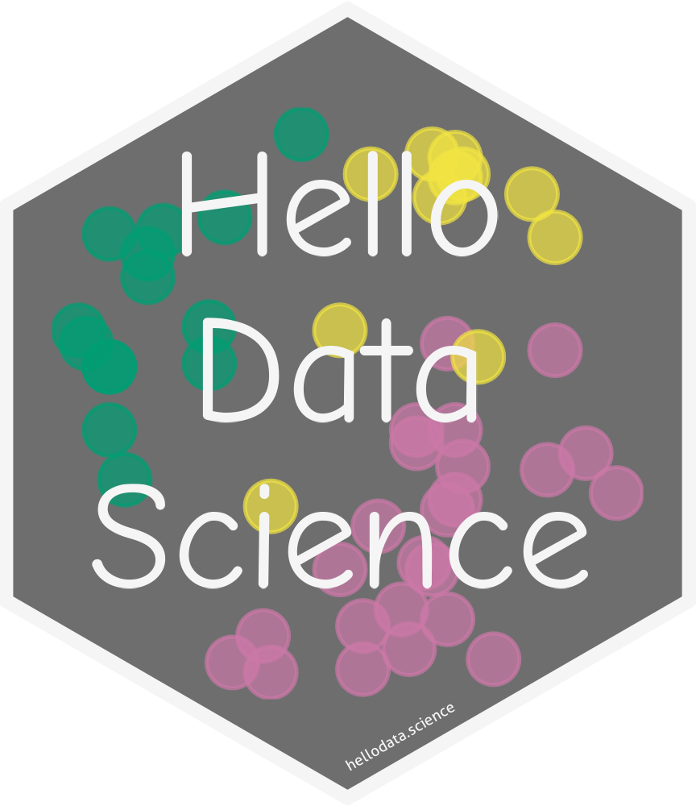

# hellodatascience

📦 R package for Supplemental Materials for the Hello Data Science Book


<!-- README.md is generated from README.Rmd. Please edit that file -->

```{r, include = FALSE}
knitr::opts_chunk$set(
  collapse = TRUE,
  comment = "#>",
  fig.path = "man/figures/README-",
  out.width = "80%"
)
```

# hellodatascience 

**hellodatascience** is a package to supplement the upcoming open-access [Hello Data Science
book](https://www.bayesrulesbook.com/). It contains datasets that are used in the book. You can find documentation on the [package website](https://hellodata-science.github.io/hellodatascience).

<hr>

## Installation

You can install `hellodatascience` from CRAN.


```{r eval=FALSE}
install.packages("hellodatascience") 
```


You can install the development version from GitHub. You would also need to install the devtools package if you do not have it installed already.

``` r
#install.packages("devtools") 
devtools::install_github("hellodata-science/hellodatascience")
```

